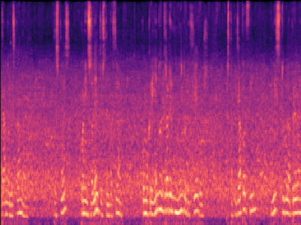

# Spoken Language Identification Using Deep Learning
## Bachelor Thesis Project

A Deep Learning-Based Approach for Spoken Language Identification

## Dataset
Kaggle's spoken language identification with 73080 samples from English, Spanish, and German languages.

## Feature Extraction
Mel Spectrogram is used for feature extraction and Mel Spectrograms are saved into `.npy` files. The model reads them using a custom data generator.

