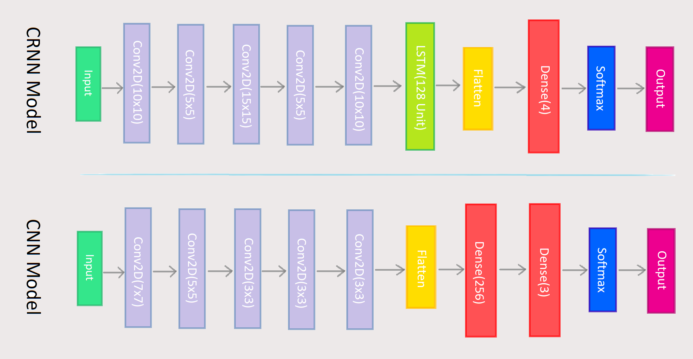
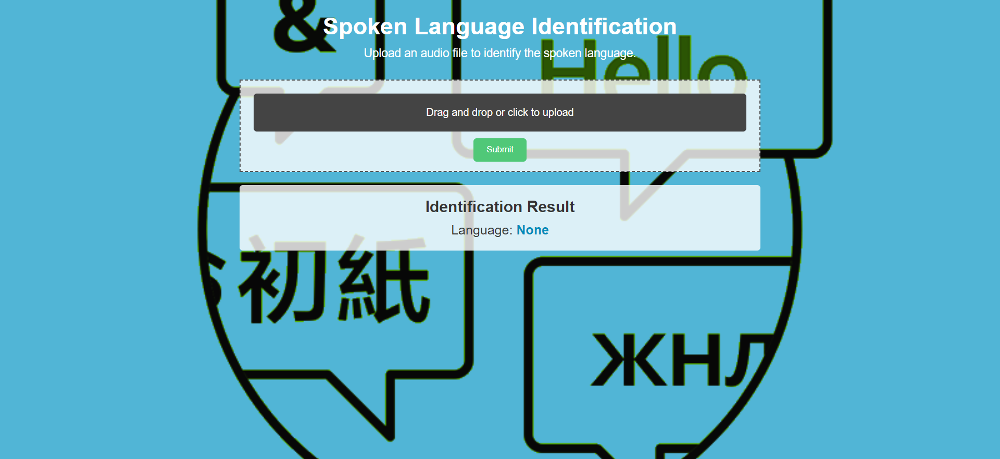

# Spoken Language Identification Using Deep Learning
## Bachelor Thesis Project

A Deep Learning-Based Approach for Spoken Language Identification

## Dataset

- Kaggle's spoken language identification with 73080 samples from English, Spanish, and German languages.
- ShEMO a large-scale validated database for Persian speech emotion detection

## Feature Extraction

Mel Spectrogram is used for feature extraction and results are saved into `.npy` files. The model reads them using a custom data generator.

## Architecture
This project implemented two different architectures CNN and CRNN.

## Website
There is also a [website](http://www.mohammadzadehasl.com/bachelor-project)! 

## Presentation video

You can watch presentation in Persian [Here](https://www.aparat.com/v/X04YW).
